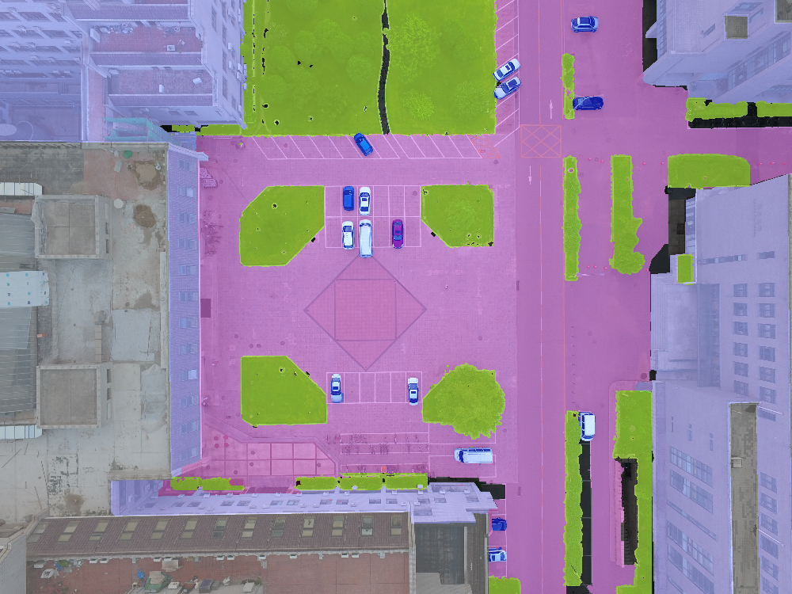
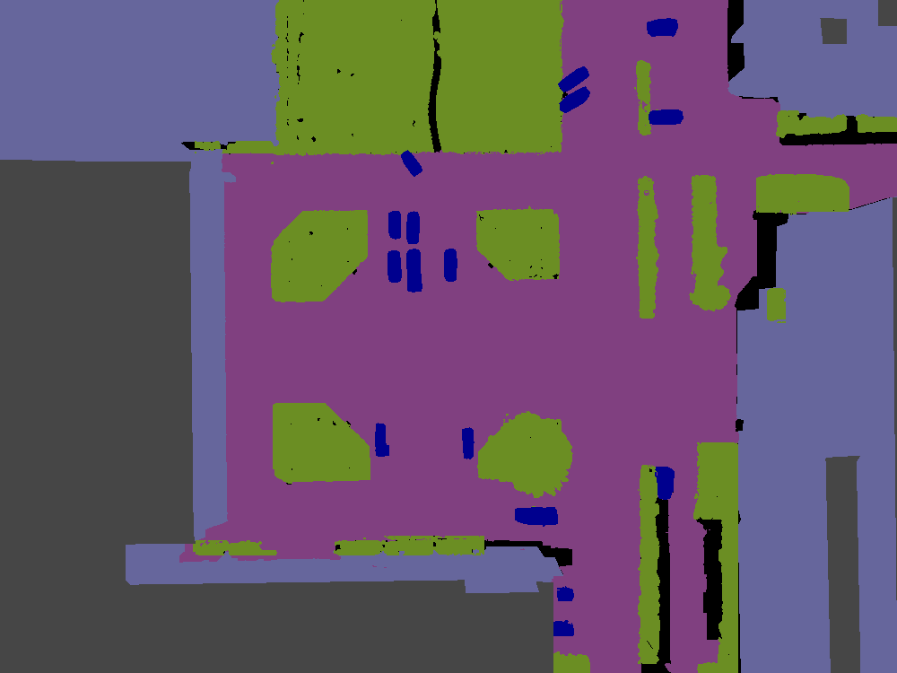

# Urban Drone Dataset(UDD)

## CHANGE LOG

|   date   |  log   |
|----------|--------|
|2018.03.15| repo init |
|2018.03.23| UDD-3 released |
|2019.11.04| UDD-5 released |
|2020.06.28| UDD-6 released. Beware of the changing Gt Label!! |
|2020.08.24| UDD Benchmark released |

Now UDD-6 is on air (*Vegetation, Building, Road, Vehicle, Roof and Other*)! See Download Link below.

### BENCHMARK
This benchmark is released to seek for better solutions for UDD dataset
| dataset |  model    | OA   | mIoU | size |
|---------|-----------|------|------|------|
|UDD5     |  GCN      |88.57%|73.17%|302M|
|UDD5     |  ENet     |88.14%|71.38%|5.5M|
|UDD6     |  GCN      |86.54%|72.58%|302M|
|UDD6     |DeepLab V3+|86.90%|73.18%|721M|

## Dataset Overview
This is a collection of drone image Dataset collected at Peking University, Huludao city, Henan University and Cangzhou city.

*example of UDD：*



**Class Definitions**

- UDD5

|   Class  |Gt Label|   RGB   |Suffix|
|----------|--------|---------|------|
|Vegetation|   0    |(107,142,35)|_t.png|
| Building |   1    |(102,102,156)|_b.png|
|  Road    |   2    |(128,64,128)|_r.png|
|  Vehicle |   3    |(0,0,142)|_v.png|
|  Other   |   4    |(0,0,0) | N/A |

- UDD6 (Released on 28 Jun 2020)

|   Class  |Gt Label|   RGB   |Suffix|
|----------|--------|---------|------|
|  Other   |   0    |(0,0,0) | N/A |
| Building |   1    |(102,102,156)|_b.png|
|  Road    |   2    |(128,64,128)|_r.png|
|Vegetation|   3    |(107,142,35)|_t.png|
|  Vehicle |   4    |(0,0,142)|_v.png|
| **Roof** |   5    |(70,70,70) |_roof.png|


## Download Link

This Dataset is only for non-commercial use. 

- [UDD-6(train, val) + UDD-5(train, val) + UDD-5_tf_Model + PKU-M1(train+val+test)](https://drive.google.com/drive/folders/1x172jM6iF6SZjMB4jH8FVRgiuGcJDtIe?usp=sharing)

## Directory Naming Policy

**/src**  ```origin source image```

**/gt**  ```ground truth```

**/gt_class** ```groundtruth split by classes```

**/ori**  ```annotation raw result(subfolders containing annotated '_t.png', '_b.png', etc. are all here)```

**/visualization** ```visualization result```
```
you can name your directories arbitrarily. Just keep them corresponding to envs in main.m
```

## Labeling & Scripts
### Labeling Policy
So far, only PS-aided labeling policy is provided, please refer to `PS-annotation` for more information.
### Scripts
Currently, most scripts are written in Matlab. For more instructions, refer to `script`.


## Citation & Acknowledgements

If you benefit from UDD, please cite our paper as:
```
@inproceedings{chen2018large,
  title={Large-scale structure from motion with semantic constraints of aerial images},
  author={Chen, Yu and Wang, Yao and Lu, Peng and Chen, Yisong and Wang, Guoping},
  booktitle={Chinese Conference on Pattern Recognition and Computer Vision (PRCV)},
  pages={347--359},
  year={2018},
  organization={Springer}
}
```
Sincerely tribute to all companions who contributed to this Dataset: *Xiao Deng(邓枭)*、*Youpeng Gu(顾友鹏)*、*Jianyuan Guo(郭健元)*、*Chen Hou(侯忱)*、*Zhao Jin(金朝)*、*Boning Song(宋博宁)*、*You'er Wen(文佑尔)*、*Yang Yao(姚洋)*、*Kangrui Yi(易康睿)*、*Haotian Zhou(周昊天)*、*Youkun Wu(吴有堃)*、*Xupu Wang(王旭普)*、*Tongwei Zhu(朱彤葳)*、*Zebin Wang(王泽斌)*。
