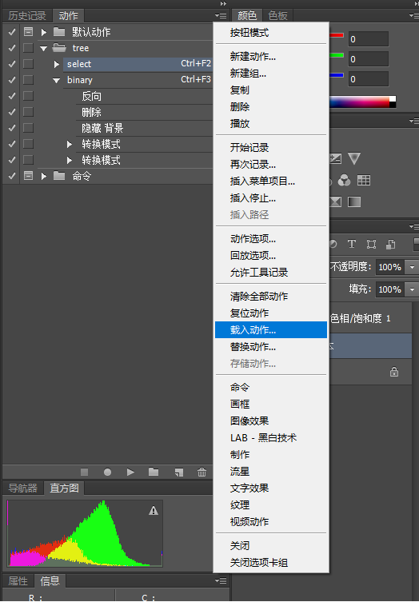
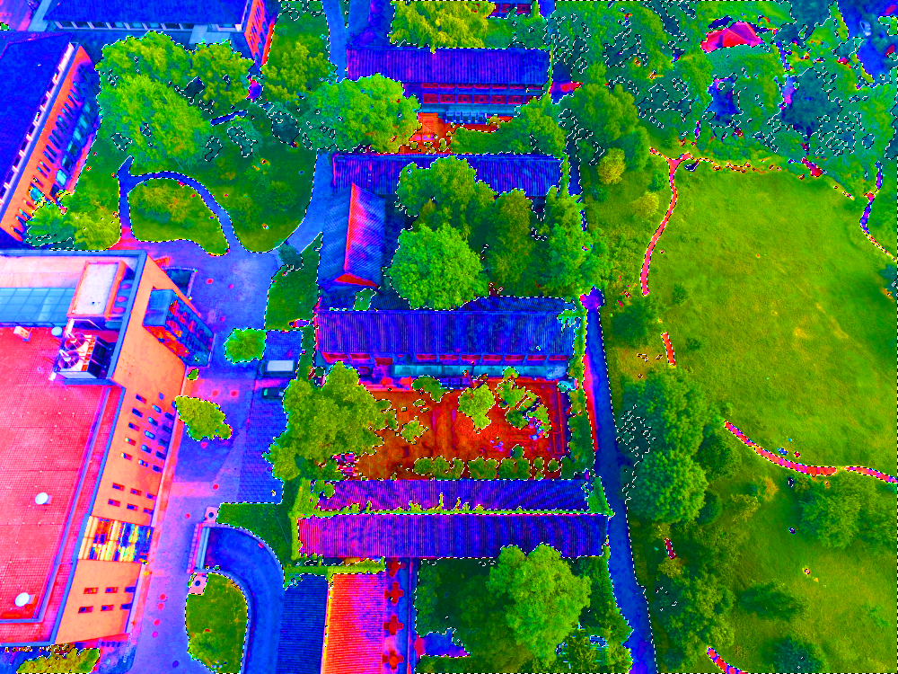

# Urban Drone Dataset(UDD)

## 0.Dataset
### 0.1 Dataset Overview
This is a collection of drone image Dataset collected at Peking University, Huludao city, Henan University and Cangzhou city.

*example of UDD：*


**Class Definitions**

|   Class  |Gt Label|   RGB   |Suffix|
|----------|--------|---------|------|
|Vegetation|   0    |(0,255,0)|_t.png|
| Building |   1    |(255,0,0)|_b.png|
|  Road   |   2    |(0,0,255)|_r.png|
|  Vehicle |   3    |(128,128,0)|_v.png|
|  Other   |  4   |(128,128,128)| N/A |


<div style="display: flex;">
    <div>
    Vegetation
    <div style="width:40px;height:20px;background-color:rgb(0,255,0);"></div>
    </div>
    <div>
    Building
    <div style="width:40px;height:20px;background-color:rgb(255,0,0);"></div>
    </div>
    <div>
    Road
    <div style="width:40px;height:20px;background-color:rgb(0,0,255);"></div>
    </div>
    <div>
    Vehicle
    <div style="width:40px;height:20px;background-color:rgb(128,128,0);"></div>
    </div>
    <div>
    Other
    <div style="width:40px;height:20px;background-color:rgb(128,128,128);"></div>
    </div>
</div>


now the 5 classes Dataset is on air(*Vegetation, Building, Road, Vehicle, Background*). See Download Link below.

### 0.2 Download Link
This Dataset is only for non-commercial use. 

- [UDD5(train, val) + Trained_Model + m1(test)](https://drive.google.com/drive/folders/1x172jM6iF6SZjMB4jH8FVRgiuGcJDtIe?usp=sharing)


## 1.Labeling Policy (instruction included)
### 1.0 Vegetation(Tree+Grass)
- 1. enter photo shop，press alt+F9 to open Action menu，load action script "tree.atn"

- 2. open the src url, and press CTRL+F2，a raw mask of tree would be generated


- 3. adjust the selected area by hand(lasso is recommended, just press shift/alt and drag the mouse)
- 4. then press CTRL+F3 to generate bitmap, save it by "_t.png" suffix，"DJI_0285_t.png",e.g.

*Annotation example*


**[Chinese version of annotation instruction](tree.pdf)**

### 1.1 Building
- 1. new a black layer, using polygon lasso to select building and fill it with black
- 2. press CTRL+F3 to generate bitmap, save it by "_b.png" suffix，"DJI_0285_t.png",e.g.

*example of annotated result*


### 1.2 Other classes
- 1. After filled ROI with black, press CTRL+F3 to generate bitmap. Remember to save it by suffix(see **Class Definitions** above)


## 2. Directory Naming Policy

**/src**  ```origin source image```

**/gt**  ```ground truth```

**/gt_class** ```groundtruth split by classes```

**/ori**  ```annotation raw result(annotated '_t.png', '_b.png', etc. are all here)```

**/visualization** ```visualization result```
```
you can name your directories arbitrarily. Just keep them corresponded to envs in main.m
```


## 3. Scripts

- ### [main.m](script/main.m)
Processing with raw annotated result. You can DIY your ground truth label here.

- ### [gtVisual.m(function, called by main.m)](script/gtVisual.m)

*parameters*：
```
visual_mode = 0; % 1 to run this script
visual_resizerate=0.25; % downsample to accelerate
visual_writemode = 0; % 1 to save visualization result
```

- ### [gtSplit.m(function, called by main.m)](script/gtSplit.m)

*parameters*：
```
split_mode = 1; % 1 to run this script
split_visualmode = 0;  % 1 to visualize
```

- ### [visualization.m](script/visualization.m)

After running main.m, you can see the visualization result in**/visualization** by running this script

*parameters*：
```
view_mode = 1; % 0 for automatic, 1 for manual
```

- ### [writeTxt.py](script/tools/writeTxt.py)
run this to prepare ```train.txt，val.txt``` for training in [tensorpack](https://github.com/MarcWong/tensorpack).


## 4.Citation

If you benefit from this code, please cite our paper:

```
@inproceedings{chen2018large,
  title={Large-scale structure from motion with semantic constraints of aerial images},
  author={Chen, Yu and Wang, Yao and Lu, Peng and Chen, Yisong and Wang, Guoping},
  booktitle={Chinese Conference on Pattern Recognition and Computer Vision (PRCV)},
  pages={347--359},
  year={2018},
  organization={Springer}
}
```

## 5. **Acknowledgements**
Sincerely tribute to all companions who contributed to this Dataset: *Xiao Deng(邓枭)*、*Youpeng Gu(顾友鹏)*、*Jianyuan Guo(郭健元)*、*Chen Hou(侯忱)*、*Zhao Jin(金朝)*、*Boning Song(宋博宁)*、*You'er Wen(文佑尔)*、*Yang Yao(姚洋)*、*Kangrui Yi(易康睿)*、*Haotian Zhou(周昊天)*、*Youkun Wu(吴有堃)*、*Xupu Wang(王旭普)*、*Tongwei Zhu(朱彤葳)*、*Zebin Wang(王泽斌)*。
